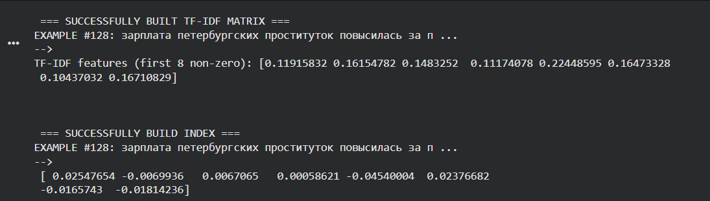
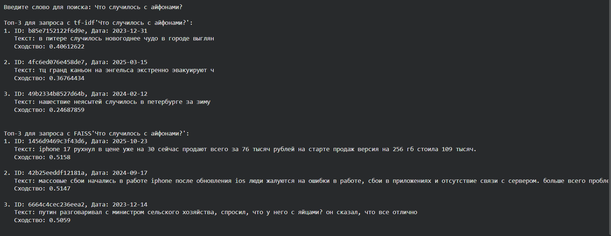

# vector_db_Telnova_Khlusova

ДЗ по векторным базам данных по курсу DL.

Структура репозитория:

```markdown
./
│
├── README.md # Основное описание проекта
├── pyproject.toml # Конфигурация проекта (uv)
├── uv.lock Файл блокировки зависимостей (uv)
├── data.csv # Очищенные данные в формате CSV
├── result.json # Напарсенные данные в формате JSON
│
├── main.py # Основной исполняемый файл
├── get_data.py # Модуль для чистки спарсенных данных
├── common_utils.py # Общие утилиты (чтение датасета и векторизация разными способами)
│
├── faiss_example.py # Модуль для векторизации с FAISS
└── tfidf_example.py # Модуль для векторизации TF-IDF
```


**Данные:** TG-канал "Питер сегодня"

Чанкинг не реализован, поскольку посты в канале достаточно короткие, при разбиении на фрагменты возможно ухудшение семантического поиска.

Результат:





Как видно из второго скришота, TF-IDF чувствителен к вариациям лексем --- айфон и iphone будут разными словами. Модель cointegrated/LaBSE-en-ru распознала оба варианта как семантически схожие (если не идентичные вовсе). TF-IDF прост в создании, но улавливает семантическое сходство хуже. Для полноценного RAG стоит векторизовать тексты моделями эмбеддингов.
